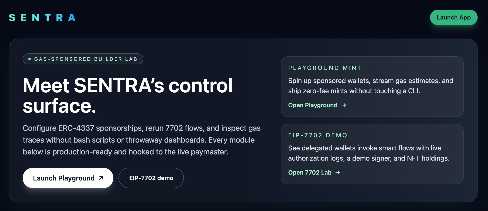
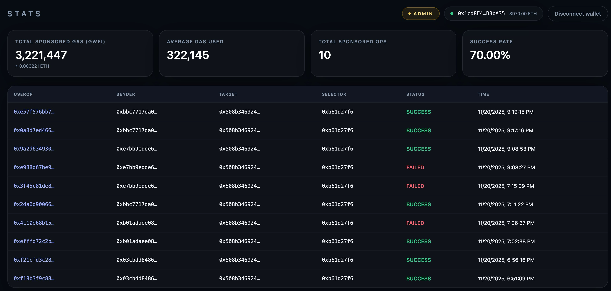
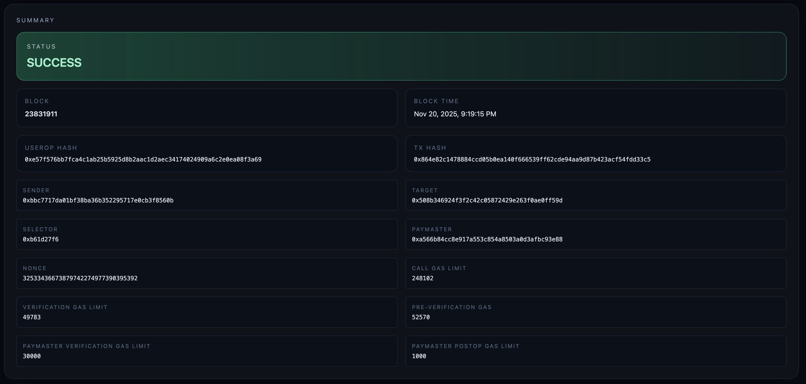
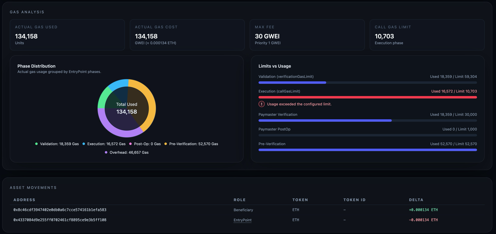
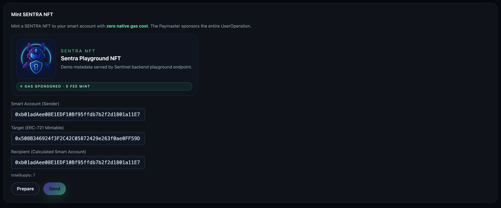
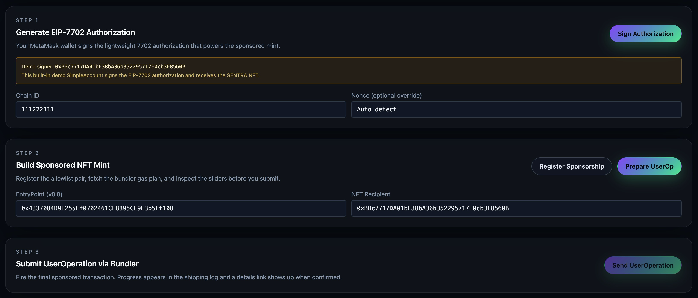
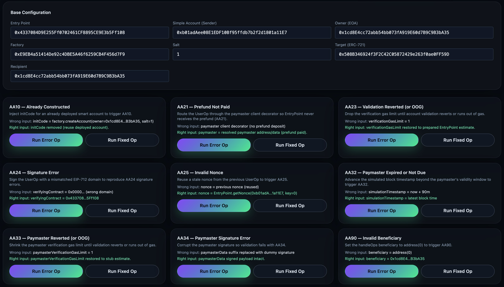
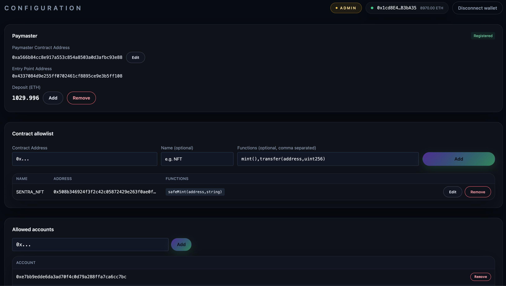

# Sentra

> A focused developer console for ERC‑4337 Account Abstraction and EIP‑7702, built end‑to‑end from smart contracts to indexer to React/viem frontend.

<p align="center">
  
</p>

- **Demo Video:** [Click to watch!](https://www.youtube.com/watch?v=Wwdrjunq9XE)
- Goal:
  - Make sponsored UserOperations ([ERC‑4337](https://eips.ethereum.org/EIPS/eip-4337)) and delegated execution ([EIP‑7702](https://eips.ethereum.org/EIPS/eip-7702)) easy to understand and safe to operate.
  - Show the full journey: from a smart account being computed to an NFT being minted and indexed, with every failure explainable.
  - Serve as a realistic reference for building production‑grade on‑chain services (not just a toy dApp).

---

## 1. Overview

**Sentra** is an end‑to‑end system that ties together:

- **On‑chain**
  - Solady / Soldeer / Foundry‑based contracts:
    - Paymaster
    - SimpleAccount‑style smart account
    - ERC‑721 NFT
    - EIP‑7702‑compatible account
- **Off‑chain**
  - Go indexer + SQLite, ingesting:
    - UserOperations and gas data
    - EntryPoint events
    - NFT mint events and balance changes
- **Frontend**
  - TypeScript + React + [viem](https://viem.sh/) console to inspect and experiment with 4337/7702 flows in real time.
- **Infrastructure**
  - Tenderly as the primary RPC/simulation environment
  - Alto as the ERC‑4337 bundler, proxied via a simple HTTP adapter

The console is designed to look and feel like something an infra/payments team would actually use to run a paymaster in production.

---

## 2. Modules & Flows

### 2.1 Stats & Details (Operations view)

- **Stats**
  - Overview cards for total sponsored gas, average gas used, success rate, and total UserOps.
  - Recent UserOps table (hash, sender, target, selector, status, time) with deep‑links into the Details page.
- **Details**
  - Summary cards for status, block + block time, UserOp hash + Tx hash.
  - Gas breakdown by phase (pre‑verification, validation, execution, post‑op).
  - Asset movements table (address / token / tokenId / delta) with ETH values normalized to ETH units.

<p align="center">
  
  
</p>

<p align="center">
  
</p>

### 2.2 Playground (0‑Fee NFT Mint)

- Computes a SimpleAccount‑style smart account from factory + owner + salt, and uses a SENTRA ERC‑721 contract as the mint target.
- Runs a fully sponsored `safeMint(address,string)` via viem + Alto bundler + an ERC‑7677 paymaster.
- Provides a Gas Scaling UI (0–150%) so you can see how changing limits affects success/failure.
- Shows a shipping‑style Mint Progress timeline that updates in real time and links into the Details page.
- Includes an NFT holdings card that refreshes automatically when a mint succeeds.

<p align="center">
  
</p>

### 2.3 EIP‑7702 Lab

- Demonstrates delegated execution via [EIP‑7702](https://eips.ethereum.org/EIPS/eip-7702) using a demo signer.
- Reuses the Playground shipping UI and Gas Scaling components so the mental model stays consistent.
- Mints the same SENTRA NFT into the delegated wallet and updates a “Demo wallet holdings” card.

<p align="center">
  
</p>

### 2.4 Simulator (AA error scenarios)

- Includes presets for common AA failure codes (AA10, AA21, AA23, AA24, AA25, AA32, AA33, AA34, AA90).
- For each preset, you can run a failing UserOp and then a “fixed” version to compare.
- Uses viem + EntryPoint ABI directly to mutate gas envelopes, beneficiary, nonce, domain, etc.
- Explains failures in plain language so non‑protocol roles can still reason about issues.

<p align="center">
  
</p>

### 2.5 Config (policy management)

- Config view helps manage:
  - Paymaster metadata (name, chain, EntryPoint).
  - Contract and function allowlists.
  - Per‑user allowlists for sponsored operations.

<p align="center">
  
</p>

---

## 3. Architecture & Tech Stack

### 3.1 Frontend

- **TypeScript, React, Vite**
  - Pages: Stats, Details, Playground, EIP‑7702 Lab, Simulator, Launch.
  - Utility‑style classnames (Tailwind‑like) for consistent layout and spacing.
- **viem**
  - Public & Wallet clients:
    - Talks to Tenderly RPC.
    - Connects to MetaMask for SIWE ([ERC‑4361](https://eips.ethereum.org/EIPS/eip-4361)) and transactional flows.
  - Account Abstraction:
    - `createBundlerClient` for [Alto](https://github.com/pimlicolabs/alto) bundler.
    - `createPaymasterClient` for an [ERC‑7677](http://eips.ethereum.org/EIPS/eip-7677)‑compatible paymaster RPC.
  - EIP‑712 and UserOperation typed data used explicitly in signing flows.
- **Account Abstraction libraries**
  - `permissionless` `toSimpleSmartAccount` for SimpleAccount construction.
  - Targets EntryPoint 0.8; uses salt/index mapping that mirrors production setups.

### 3.2 Backend & Indexer

> This repository focuses on the frontend and AA clients; the actual Go indexer lives in a separate module.  
> The description below reflects the overall architecture.

- **Go indexer**
  - Consumes chain events and user operations, persists to SQLite.
  - Exposes REST/WebSocket APIs that power:
    - Stats and recent operations
    - Per‑operation detail & gas breakdown
    - NFT holdings per address
    - Real‑time event stream for the shipping‑style timelines
  - Computes asset movements (both ETH and NFTs) per UserOp so the frontend can visualize flows without extra joins.
  - Provides an ERC‑7677‑compatible paymaster endpoint consumed by the viem `createPaymasterClient`.
- **SQLite**
  - Chosen to keep local/demo iterations fast.
  - Schema is intentionally flat around `UserOp + Gas + AssetMovement` so that most frontend views map 1‑to‑1 to a single query.

### 3.3 Smart Contracts

- **Solidity with Solady / Soldeer / Foundry**
  - Paymaster
  - SimpleAccount‑style account
  - ERC‑721 NFT
  - EIP‑7702‑compatible account
  - Integrated ERC‑4337 v0.8 EntryPoint end‑to‑end (contracts and clients).
  - Heavy use of Foundry for:
    - Unit tests
    - AA error scenario generation (AA10/AA21/AA23/AA24/AA25/AA32/AA33/AA34/AA90).
     - Deployment scripts that can be reused across environments.
     - Verification scripts compatible with Etherscan‑style explorers.
- **Account Abstraction**
  - Models the full UserOperation lifecycle:
    - `initCode`, `callData`, gas envelopes, `paymasterAndData`, `signature`.
  - Experiments with:
    - Paymaster stub vs paymaster data.
    - EIP‑7702 authorization struct and validation.

### 3.4 Infra

- **Tenderly**
  - Custom testnet, RPC, and simulation.
  - Integrated as the primary viem chain; makes it easy to correlate console views with Tenderly traces.
- **Alto (Bundler)**
  - Used as the ERC‑4337 bundler for all Playground and Simulator flows, so gas behavior and error modes match real 4337 environments.
  - Bundler design and EntryPoint integration are aligned with the [AA v0.8 reference implementation](https://github.com/eth-infinitism/account-abstraction).

---

## 4. Focus Areas & Responsibilities

This project was designed as more than a UI demo; it’s meant to exercise the full stack that a production AA‑based service would rely on.

- **Smart contracts**
  - Designed and implemented Paymaster, smart accounts, and NFT contracts using Solady (gas‑optimized primitives) and managed via Soldeer (Solidity package manager).
  - Used Foundry to reproduce and validate AA error codes.
  - Wrote deployment & verification scripts (Etherscan‑compatible) so contracts can be consistently shipped and audited across networks.
- **Off‑chain indexer & APIs**
  - Structured a Go + SQLite indexer that:
    - Follows the flow of UserOperations across EntryPoint and target contracts.
    - Exposes data in shapes the frontend can consume directly (stats, details, asset movements).
- **Frontend console**
  - Built the multi‑tab console in React + viem, with:
    - SIWE ([ERC‑4361](https://eips.ethereum.org/EIPS/eip-4361)) login and role‑based access (admin vs regular user).
    - A Playground that feels like a production “mint console” rather than a basic form.
    - A Simulator that teaches AA errors with concrete, reproducible runs.
- **Operational UX**
  - Added WebSocket‑driven status updates so the UI feels like a live shipping tracker for UserOps.
  - Normalized error messages and gas visuals so non‑protocol folks can still reason about failures.

---

## 5. Running Locally

### 5.1 Prerequisites

- Node.js 18+
- pnpm 8+
- A running backend and bundler compatible with the described architecture.

Env vars (`.env`)

```env
# Sentra backend API base URL
API_URL=https://sentra-api.example.com

# Tenderly RPC endpoint or any compatible JSON-RPC node
RPC_URL=https://tenderly.example.com

# Alto (ERC-4337) bundler endpoint
BUNDLER_URL=https://alto-bundler.example.com
```

### 5.2 Commands

```bash
pnpm install       # install dependencies
pnpm dev           # start dev server
pnpm build         # production build
pnpm tsc --noEmit  # type check
```

---

## 6. Known Limitations

### 6.1 EIP‑7702 + Bundler support

- The 7702 lab currently uses a demo private key for the authorization signature, instead of signing with MetaMask directly.
- Reason:
  - Alto, the bundler used in this project, expects a raw 7702 authorization signature.
  - MetaMask, for security reasons, blocks `eth_sign` on custom chains, which makes it difficult to provide the exact raw signature format Alto wants through viem + MetaMask alone.
- As a result:
  - The 7702 flow is accurate from a protocol perspective, but the authorization is produced by a demo key rather than the connected wallet.
  - This reflects a practical limitation at the intersection of 7702 + 4337 + current wallet/bundler tooling.

---

## 7. Future Directions

- **ERC‑20 paymaster support**
  - Extend the paymaster and console to support sponsored gas paid in ERC‑20 tokens, not just native ETH.
- **Oracle‑backed pricing**
  - Integrate an oracle to price ERC‑20 sponsorships and enforce per‑operation/per‑user budgets more robustly.

---

## 8. License

Proprietary – internal use only unless otherwise specified.
